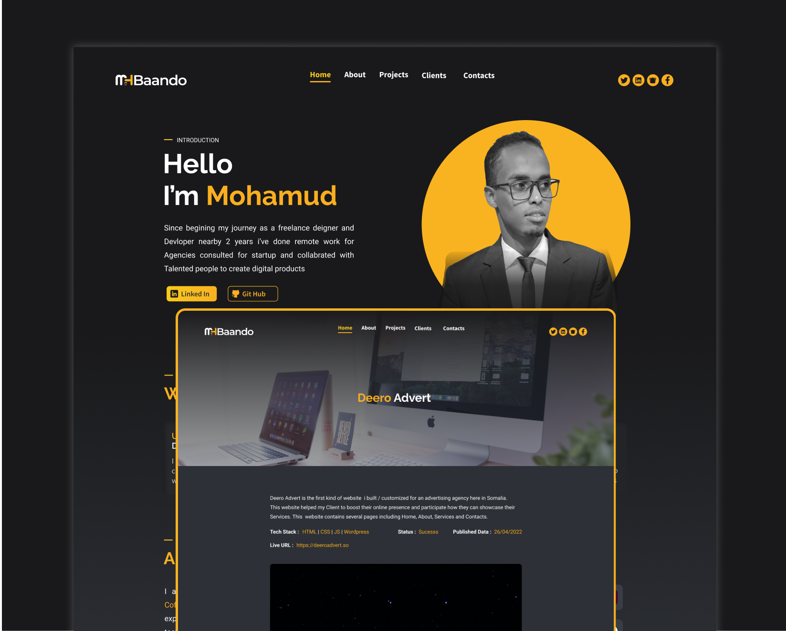

## Aboute Me

i am Mohamud Abshir , I am a professional Front-End developer, with almost
`2 years` of experience in developing and designing web applications, landing
pages, personal sites, corporate websites, and so on using various technologies
such us `HTML`,`CSS`,`JavaScript`,`React`,
`Angular`,`Node js`,`SCSS`,`Bootstrap`. also i develop websites using no code
platforms such us `webflow` &`wordpress` also i am a `UI/UX` designer with
background of `Graphic Design`, `llustrations`,`2D animations` and a little bit
of`Digital Marketing`

`Please dont Hesitate to contact me if you have a project i can contribute`

## Please follow Me on Mysocial

please also check my social networks with this tag`mhbaando`

- <https://www.facebook.com/mhbaando>
- <https://www.instagram.com/mhbaando>
- <https://www.linkedin.com/in/mhbaando>
- <https://www.twitter.com/mhbaando>

## CLONE AND RUN THE PROJECT

- Incase You Need to Clone or Download this project
- This is website built in `Next js` `SCSS` `TypeScript` `Strapi`
- Make sure `node` Is installed on your computer
- Open Terminal with in the folder and type `npm install` to install all
  dependecies
- type `npm run dev` to run the application on a local host
- and dont forget to give this repo a star

## SCREENSHOT OF THE WEBSITE

---

